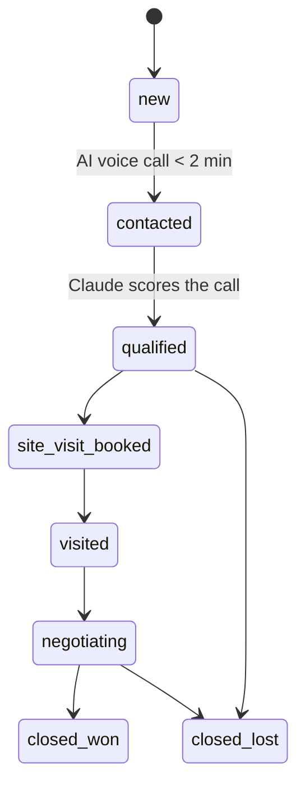

# Realty Engine

> An autonomous AI acquisition engine for real estate developers. A single operator runs voice calling, lead scoring, multi-channel follow-up, ad-creative generation, and a 30-day social calendar across 5–10 developer clients.

Built as a TypeScript monorepo on Next.js 14, Supabase, and Claude. Every new lead is called back by an AI voice agent within two minutes, qualified in natural Hinglish, scored, and pushed through a fully event-driven follow-up pipeline — with no human in the loop until the prospect is sales-ready.

---

## Why this exists

In Indian real estate, response speed is the single largest lever on conversion — a lead contacted within five minutes converts dramatically better than one contacted an hour later. But developers can't staff a call centre that responds in two minutes, 24/7, in the buyer's own code-switched Hinglish.

Realty Engine is that call centre, as software. One person operates the entire acquisition funnel for multiple developers from a single dashboard.

---

## Architecture

A pnpm workspace monorepo. The Next.js app is the surface (dashboard, client portal, API/webhooks); the domain logic lives in focused, independently-typed packages; long-running and scheduled work runs on a durable Inngest queue.

```
┌─────────────────────────────────────────────────────────────────┐
│                         apps/web (Next.js 14)                     │
│   Operator dashboard · Client portal · Landing pages · API routes │
└───────────────┬───────────────────────────────┬─────────────────┘
                │ webhooks / server actions        │ enqueue
                ▼                                   ▼
       ┌─────────────────┐                 ┌─────────────────┐
       │  packages/*      │                 │   Inngest jobs   │
       │  domain logic    │◀───────────────▶│ voice-completed  │
       │                  │                 │ creatives        │
       │ core  · voice    │                 │ cron-monitoring  │
       │ messaging        │                 └─────────────────┘
       │ content · social │
       └────────┬─────────┘
                │
                ▼
   ┌────────────────────────────────────────────────────────────┐
   │ External services (all calls Zod-validated, retried, logged) │
   │ Claude · Bolna+Sarvam (voice) · AiSensy (WA) · Brevo (email) │
   │ Meta Ads · Supabase Postgres                                 │
   └────────────────────────────────────────────────────────────┘
```

### Lead lifecycle

The core state machine every module reads from and writes to:



### Packages

| Package | Responsibility |
|---|---|
| `packages/core` | Shared types, Supabase client, validated env, Claude client, structured logger, E.164 phone handling, signed-webhook verification, retry-with-backoff fetch |
| `packages/voice` | Bolna call orchestration, Sarvam STT/TTS, post-call webhook handling + transcript scoring |
| `packages/messaging` | AiSensy (WhatsApp templates) + Brevo (email) wrappers and the multi-step follow-up sequence engine |
| `packages/content` | Claude-driven generation of ad creatives, a 30-day social calendar, and personalised follow-up copy; Meta Ads payload builders |
| `packages/social` | Social post scheduler and Meta publishing |

---

## Tech stack

| Layer | Choice |
|---|---|
| Runtime / language | Node.js 20, TypeScript (strict) |
| Framework | Next.js 14 App Router (React Server Components) |
| Database / auth | Supabase Postgres |
| AI | Claude (`@anthropic-ai/sdk`) |
| Voice | Bolna (Hinglish telephony) + Sarvam (STT/TTS) |
| Messaging | AiSensy (WhatsApp), Brevo (email) |
| Jobs / scheduling | Inngest (durable drips, retries, cron) |
| Validation | Zod on every external boundary |
| Styling | Tailwind + shadcn/ui |
| Hosting | Vercel |

---

## Key engineering decisions

- **Event-driven, not cron-soup.** Every lead signal fires through Inngest. Calls, drips, and retries are durable steps that survive process restarts and provider failures instead of being dropped.
- **Validate at the boundary.** Every external API response is parsed through Zod before it touches domain logic, so malformed third-party payloads fail loudly and early rather than corrupting state downstream.
- **No PII in logs.** Phone numbers and emails are masked before logging; numbers are normalised and stored as E.164 (`+91…`).
- **Money is integers.** All amounts are stored in paise — never floats — to avoid rounding drift.
- **RSC + URL state, no client state library.** No Redux/Zustand. State lives on the server and in the URL, keeping the client lean.
- **Supabase client directly, no ORM.** Avoids a heavy abstraction over a schema this team fully owns; migrations are plain, ordered SQL.
- **Hinglish ≠ Hindi.** The voice agent speaks Roman-script code-switched Hinglish, matching how Indian buyers actually talk — not translated Devanagari.

---

## Project structure

```
apps/web/                 Next.js app: dashboard, client portal, API routes, Inngest jobs
  app/(dashboard)/        Operator dashboard (leads, pipeline, analytics, campaigns, social…)
  app/portal/             Per-client portal
  app/api/                Webhooks (voice, lead sources), generation endpoints, admin
  inngest/functions/      Durable background jobs
packages/core/            Shared types, db, env, Claude, logging, phone, webhook verify
packages/voice/           Bolna + Sarvam integration
packages/messaging/       AiSensy + Brevo + follow-up sequences
packages/content/         Claude prompts for ads, social, follow-ups
packages/social/          Scheduler + Meta publishing
supabase/migrations/      Ordered SQL migrations
scripts/                  Seed + bulk-upload utilities
docs/                     Setup, runbooks, integration guides
```

---

## Local development

Requires Node.js 20 and pnpm.

```bash
pnpm install

# Configure environment
cp .env.example .env.local      # then fill in keys (see docs/setup.md)

# Run the app + workers
pnpm dev                        # Next.js + package watchers
pnpm inngest:dev                # Inngest dev server (background jobs)

# Database (Supabase): run migrations in order from supabase/migrations/

# Optional: seed demo data
pnpm seed:demo
```

| Script | Purpose |
|---|---|
| `pnpm dev` | Run web app and packages in watch mode |
| `pnpm build` | Build all workspaces |
| `pnpm type-check` | Type-check every workspace |
| `pnpm inngest:dev` | Local Inngest dev server |
| `pnpm seed` / `pnpm seed:demo` | Seed baseline / demo data |

See [`docs/setup.md`](docs/setup.md) for full production setup and [`docs/`](docs/) for integration runbooks (Bolna, WhatsApp templates, UTM conventions, testing flow).

---

## The five modules

1. **AI voice agent** — calls every new lead within two minutes, qualifies in Hinglish, and scores the call.
2. **Follow-up engine** — Claude-personalised WhatsApp + email sequences, timed and adapted to lead behaviour.
3. **Lead generation** — landing-page templates fed by Meta/Google ads.
4. **Content brain** — Claude generates ad variants, social posts, and call scripts on demand.
5. **Social scheduler** — a 30-day calendar, approved by the operator and auto-published.
